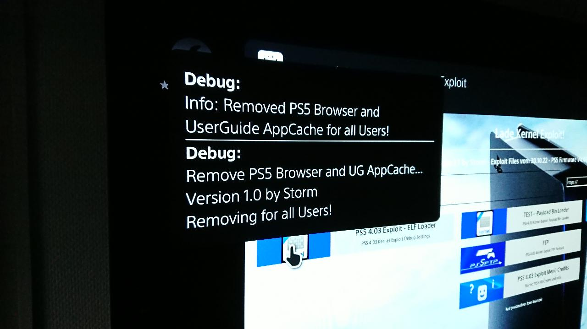

# PS5 Browser_appCache_remove

Removes the browser and User Guide appCache for all users...

Version 1.0 by Storm

Because the Function setting (Settings/System/Web Browser/Clear Website Data) on the PS5 doesn't do anything.
In any case, nothing is deleted for me when I have a page in the offline cache.
That's why I made this payload: All offline cache files for all users are deleted.
Tested on PS5 4.03.
The files can also be deleted manually with FTPS5...

Files to delete:

	user/home/user_folder/webkit/shell/NKCookie.jar.db
	user/home/user_folder/webkit/shell/NKCookie.jar.db-shm
	user/home/user_folder/webkit/shell/NKCookie.jar.db-wal
	user/home/user_folder/webkit/shell/appcache/ApplicationCache.db
	user/home/user_folder/webkit/shell/appcache/ApplicationCache.db-shm
	user/home/user_folder/webkit/shell/appcache/ApplicationCache.db-wal
	user/home/user_folder/webkit/shell/local/https_manuals.playstation.net_0.localstorage
	user/home/user_folder/webkit/shell/local/https_manuals.playstation.net_0.localstorage-shm
	user/home/user_folder/webkit/shell/local/https_manuals.playstation.net_0.localstorage-wal
	user/home/user_folder/webkit/shell/resourceloadstatistics/full_browsing_session_resourceLog.plist

## Credits:

[SiSTRo](https://github.com/SiSTR0/FTPS5): Thanks for FTPS5 Payload Source which I used as an example

[zecoxao](https://github.com/zecoxao/FTPS5): Thanks for v1.0 FTPS5 Payload Source
